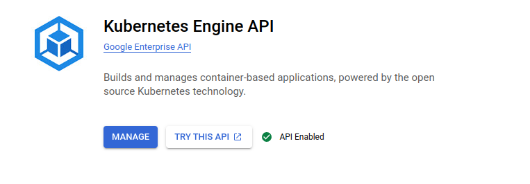

# summarizer

This repository contains a FastAPI application that serves as a summarizer for text data. The application is deployed using Docker and Kubernetes on Google Cloud Platform (GCP). The summarizer application is built using the Hugging Face Transformers library, which provides a simple API for Natural Language Processing (NLP) tasks. The model used in this application is the `facebook/bart-large-cnn` model, which is a pre-trained model for text summarization tasks. The application is deployed on local and on Google Cloud Platform (GCP) using Kubernetes Engine (GKE) and Helm.

## Run code in your local machine

### Create virtual environment, install required packages and download pretrained checkpoints
We will use Python 3.8
```shell
make venv
source venv/bin/activate
python3.8 download_pretrained_model.py
```

## On-premise deployment

### Run the API from venv in local

```
uvicorn main:app --host 0.0.0.0 --port 30000
```
Then, you can try the API at `localhost:30000/docs`.

### Running application docker container in local 

- Build and run the Docker image using the following command

```bash
make app_local_up
```

Navigating FastAPI deployement model using `localhost:8085/docs` on host machine


## Cloud migration

Deployment of the summarizer application on Google Cloud Platform (GCP) using terraform, kubernetes and helm.

### Application service deployment in GKE

To migrate our application service to the cloud using Google Cloud Platform (GCP), we'll start by enabling the Kubernetes Engine API as shown below:



#### Create a project in GCP

First we need to create a project in [GCP](https://console.cloud.google.com/projectcreate?hl=vi&pli=1)

#### Install gcloud CLI
- gclound CLI can be installed in the following document

- Initialize gcloud CLI, and authenticate with GCP

```bash
gcloud init
```
- A pop-up will prompt us  to select your Google account. Select the account associated with your GCP registration and click `Allow`.

- Go back to your terminal, in which you typed `gcloud init`, type 1, and Enter.

- Select the GCE zone corresponding to europe-west4-a (in my case), then Enter.


#### Install gke-cloud-auth-plugin

In the next step, we'll install the GKE Cloud Authentication Plugin for the gcloud CLI tool. This plugin facilitates authentication with GKE clusters using the gcloud cli.

We can install the plugin using the following command:

`sudo apt-get install google-cloud-cli-gke-gcloud-auth-plugin`

This command will install the necessary plugin for authenticating with GKE clusters.

#### Using terraform to create GKE cluster

Terraform is a powerful infrastructure as code tool that allows us to define and provision infrastructure in a declarative manner. It helps to facilitate to automate the creation, modification, and deletion of infrastructure resources across various cloud providers.

To provision a GKE cluster using Terraform, follow these steps:

- We should update the invidual project ID, the corresponding GKE zone and its node machine. In my case, a gke cluster will be deployed in zone `europe-west4-a` with its node machine is: 

```bash 
cd terraform
terraform init  # Initialize Terraform in the directory
terraform plan  # Plan the configuration
terraform apply # Apply the configuration to create the GKE cluster
```

- A created cluster will be pop up in GKE UI (after 8 to 10 minutes)


- connect to gke cluster using `gcloud cli`

```bash
gcloud container clusters get-credentials mlopsllm-gke --zone europe-west4-a --project mlopsllm
```
- To view your highlighted cluster ID in the terminal, you can use the `kubectx` command.

#### Install kubectl, kubectx and kubens

Ensure that we have these tools to manage k8s cluster

What are kubectx and kubens?

- kubectx is a tool to switch between contexts (clusters) on kubectl faster.
- kubens is a tool to switch between Kubernetes namespaces (and configure them for kubectl) easily.

To install these tools, follow the instructions provided in the following section: https://github.com/ahmetb/kubectx#manual-installation-macos-and-linux.

In my case kubens and kubectl cli were saved in `usr/local/bin/`.

##### Deploy nginx ingress controller

An Ingress controller is a specialized load balancer for k8s enviroment, which accept traffic from outside the k8s platform, and load balance it to application containers running inside the platform. 

Deploy Nginx ingress controller in corresponding name space in following commands: 

```bash
cd helm/nginx-ingress    
kubectl create ns nginx-ingress # Create a K8s namespace nginx-ingress
kubens nginx-ingress            # switch the context to the newly created namespace 'nginx-ingress'
helm upgrade --install nginx-ingress-controller . # Deploy nginx Ingress 
```

Verify if the pod running in the specified namespace nginx-ingress
```bash
kubectl get pods -n nginx-ingress
```

- Get IP address of nginx-ingress
```bash
kubectl get svc -n nginx-ingress
```


Copy the external IP address to the `host` in deployment/templates/app-nginx-ingress.yaml file

##### Deploy model serving service

Deploy the FastAPI application container on GKE within the model-serving namespace. One replica will be created, corresponding to the one pod running the FastAPI application.

```bash
cd helm/deployment
kubectl create ns model-serving
kubens model-serving
helm upgrade --install summarizer .
```

- You can access the API in `NGINX_EXTERNAL_IP.nip.io/docs`

kubectl describe pod <pod-name> -n model-serving

